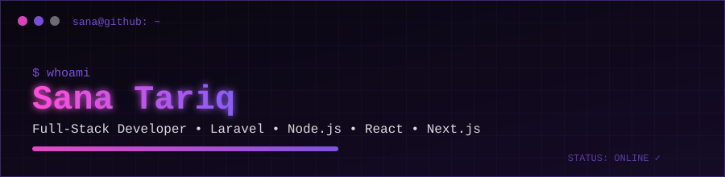

<p align="center">
  
</p>

<div align="center">

# Sana Tariq

### Full-Stack Developer • Laravel • Node.js • React • Next.js

**Building clean, scalable and user-focused web applications from backend to frontend.**

[](https://www.linkedin.com/in/sana-tariq-420259284/)
[](https://github.com/sanatariq09)
[](mailto:sanatarique17@gmail.com)

</div>

---

## `sana@github:~$ whoami`

```php
<?php

final class SanaTariq extends FullStackDeveloper
{
    public string $role = 'Full-Stack Developer';

    public array $backend = [
        'PHP',
        'Laravel',
        'Node.js',
    ];

    public array $frontend = [
        'React.js',
        'Next.js',
        'Vite',
        'Tailwind CSS',
        'Bootstrap',
    ];

    public array $databases = [
        'MySQL',
        'MongoDB',
    ];

    public array $principles = [
        'SOLID',
        'DRY',
        'KISS',
        'Clean Code',
    ];

    public function mission(): string
    {
        return 'Build reliable and user-friendly products with clean code.';
    }
}
```

---

# `> system.profile`

```yaml
developer:
  name: Sana Tariq
  role: Full-Stack Developer

focus:
  - Full-Stack Web Development
  - Backend Development
  - Frontend Development
  - API Integration
  - Clean & Maintainable Code

backend:
  - PHP
  - Laravel
  - Node.js

frontend:
  - React.js
  - Next.js
  - Vite
  - Tailwind CSS
  - Bootstrap
  - HTML
  - CSS / Sass

databases:
  - MySQL
  - MongoDB

tools:
  - Git
  - Figma
  - Vercel
  - Netlify
  - cPanel

engineering_principles:
  - SOLID
  - DRY
  - KISS
  - Readable Code
  - Maintainable Code

status:
  coding: true
  learning: always
  building: true
```

---

# ⚡ `TECH ARSENAL`

## `> backend --list`

<p>
  
</p>

```text
Laravel      ████████████████████  CORE
PHP          ████████████████████  CORE
Node.js      █████████████████░░░  ACTIVE
```

---

## `> frontend --list`

<p>
  
</p>

`React.js` • `Next.js` • `Vite` • `Tailwind CSS` • `Bootstrap` • `JavaScript` • `TypeScript`

---

## `> database --status`

<p>
  
</p>

```sql
SELECT technology, status
FROM developer_stack
WHERE category = 'database';

+------------+------------+
| Technology | Status     |
+------------+------------+
| MySQL      | Production |
| MongoDB    | Active     |
+------------+------------+
```

---

## `> tools --scan`

<p>
  
</p>

```bash
$ toolchain status

Git ............. READY
GitHub .......... READY
Figma ........... READY
Vercel .......... READY
Netlify ......... READY
cPanel .......... READY
```

---

# 🧠 `ENGINEERING PROFILE`

```text
┌────────────────────────────────────────────────────┐
│                                                    │
│  FULL-STACK DEVELOPMENT    ████████████████████   │
│  BACKEND DEVELOPMENT       ███████████████████░   │
│  FRONTEND DEVELOPMENT      ███████████████████░   │
│  DATABASE DEVELOPMENT      ██████████████████░░   │
│  UI IMPLEMENTATION         █████████████████░░░   │
│                                                    │
└────────────────────────────────────────────────────┘
```

I enjoy turning ideas into complete web experiences — from backend logic and databases to responsive and interactive user interfaces.

**My development priorities:**

- ⚡ Performance
- 🧩 Maintainability
- 📖 Readability
- 📱 Responsive UI
- 🔐 Reliability
- 🚀 Continuous improvement

---

# 🔥 `CURRENT PROCESS`

```bash
sana@github:~$ ps aux | grep developer

PID     PROCESS                         STATUS
001     Full-Stack Development          RUNNING
002     Laravel Development             RUNNING
003     Node.js Development             RUNNING
004     React.js                        RUNNING
005     Next.js                         RUNNING
006     UI Development                  RUNNING
007     Clean Code                      ALWAYS_ON
008     Continuous Learning             ALWAYS_ON

sana@github:~$ echo $MINDSET

"Learn. Build. Improve. Repeat."

sana@github:~$ _
```

---

# 🚀 `WHAT I BUILD`

<table>
<tr>
<td width="50%" valign="top">

### ⚙️ Backend Applications

Scalable backend logic and APIs using modern development practices.

```text
PHP
Laravel
Node.js
REST APIs
Authentication
Database Logic
```

</td>

<td width="50%" valign="top">

### 🎨 Frontend Experiences

Responsive and interactive interfaces for modern web products.

```text
React.js
Next.js
Tailwind CSS
Bootstrap
Vite
Responsive UI
```

</td>
</tr>

<tr>
<td width="50%" valign="top">

### 🗄️ Data-Driven Applications

Applications powered by structured and flexible data stores.

```text
MySQL
MongoDB
CRUD Systems
Data Management
Queries
```

</td>

<td width="50%" valign="top">

### 🚀 Deployment & Delivery

Taking applications from development to production.

```text
Vercel
Netlify
cPanel
Git
GitHub
```

</td>
</tr>
</table>

---

# 💻 `DEVELOPER TERMINAL`

```console
┌──(sana㉿github)-[~/profile]
└─$ ./developer --info

[+] Name .............. Sana Tariq
[+] Role .............. Full-Stack Developer
[+] Backend ........... Laravel / PHP / Node.js
[+] Frontend .......... React / Next.js
[+] Styling ........... Tailwind / Bootstrap
[+] Database .......... MySQL / MongoDB
[+] Tools ............. Git / Figma
[+] Current Status .... BUILDING

Scanning repositories...

████████████████████████████████████████ 100%

System status: STABLE
Developer status: ONLINE ✓
```

---

# 🎯 `CURRENT MISSION`

```javascript
const developer = {
    name: "Sana Tariq",
    role: "Full-Stack Developer",
    backend: ["Laravel", "PHP", "Node.js"],
    frontend: ["React", "Next.js"],
    databases: ["MySQL", "MongoDB"],
    mindset: "clean, readable and maintainable code"
};

while (developer.isCoding) {
    learn();
    build();
    improve();
    ship();
}
```

---

# 📊 `GITHUB TELEMETRY`

<div align="center">


</div>

<br>

<div align="center">

</div>

---

# 📡 `ACTIVITY MONITOR`

<div align="center">

</div>

---

# 🤝 `ESTABLISH CONNECTION`

<div align="center">

[](https://www.linkedin.com/in/sana-tariq-420259284/)
[](https://github.com/sanatariq09)
[](mailto:sanatarique17@gmail.com)

</div>

---

<div align="center">

```text
> profile scan complete.

> Thanks for visiting.

> See you in the next commit. █
```


**Sana Tariq © 2026**

</div>
<p align="center">
  
</p>

<div align="center">

# Sana Tariq

### Full-Stack Developer • Laravel • Node.js • React • Next.js

**Building clean, scalable and user-focused web applications from backend to frontend.**

[](https://www.linkedin.com/in/sana-tariq-420259284/)
[](https://github.com/sanatariq09)
[](mailto:sanatarique17@gmail.com)

</div>

---

## `sana@github:~$ whoami`

```php
<?php

final class SanaTariq extends FullStackDeveloper
{
    public string $role = 'Full-Stack Developer';

    public array $backend = [
        'PHP',
        'Laravel',
        'Node.js',
    ];

    public array $frontend = [
        'React.js',
        'Next.js',
        'Vite',
        'Tailwind CSS',
        'Bootstrap',
    ];

    public array $databases = [
        'MySQL',
        'MongoDB',
    ];

    public array $principles = [
        'SOLID',
        'DRY',
        'KISS',
        'Clean Code',
    ];

    public function mission(): string
    {
        return 'Build reliable and user-friendly products with clean code.';
    }
}
```

---

# `> system.profile`

```yaml
developer:
  name: Sana Tariq
  role: Full-Stack Developer

focus:
  - Full-Stack Web Development
  - Backend Development
  - Frontend Development
  - API Integration
  - Clean & Maintainable Code

backend:
  - PHP
  - Laravel
  - Node.js

frontend:
  - React.js
  - Next.js
  - Vite
  - Tailwind CSS
  - Bootstrap
  - HTML
  - CSS / Sass

databases:
  - MySQL
  - MongoDB

tools:
  - Git
  - Figma
  - Vercel
  - Netlify
  - cPanel

engineering_principles:
  - SOLID
  - DRY
  - KISS
  - Readable Code
  - Maintainable Code

status:
  coding: true
  learning: always
  building: true
```

---

# ⚡ `TECH ARSENAL`

## `> backend --list`

<p>
  
</p>

```text
Laravel      ████████████████████  CORE
PHP          ████████████████████  CORE
Node.js      █████████████████░░░  ACTIVE
```

---

## `> frontend --list`

<p>
  
</p>

`React.js` • `Next.js` • `Vite` • `Tailwind CSS` • `Bootstrap` • `JavaScript` • `TypeScript`

---

## `> database --status`

<p>
  
</p>

```sql
SELECT technology, status
FROM developer_stack
WHERE category = 'database';

+------------+------------+
| Technology | Status     |
+------------+------------+
| MySQL      | Production |
| MongoDB    | Active     |
+------------+------------+
```

---

## `> tools --scan`

<p>
  
</p>

```bash
$ toolchain status

Git ............. READY
GitHub .......... READY
Figma ........... READY
Vercel .......... READY
Netlify ......... READY
cPanel .......... READY
```

---

# 🧠 `ENGINEERING PROFILE`

```text
┌────────────────────────────────────────────────────┐
│                                                    │
│  FULL-STACK DEVELOPMENT    ████████████████████   │
│  BACKEND DEVELOPMENT       ███████████████████░   │
│  FRONTEND DEVELOPMENT      ███████████████████░   │
│  DATABASE DEVELOPMENT      ██████████████████░░   │
│  UI IMPLEMENTATION         █████████████████░░░   │
│                                                    │
└────────────────────────────────────────────────────┘
```

I enjoy turning ideas into complete web experiences — from backend logic and databases to responsive and interactive user interfaces.

**My development priorities:**

- ⚡ Performance
- 🧩 Maintainability
- 📖 Readability
- 📱 Responsive UI
- 🔐 Reliability
- 🚀 Continuous improvement

---

# 🔥 `CURRENT PROCESS`

```bash
sana@github:~$ ps aux | grep developer

PID     PROCESS                         STATUS
001     Full-Stack Development          RUNNING
002     Laravel Development             RUNNING
003     Node.js Development             RUNNING
004     React.js                        RUNNING
005     Next.js                         RUNNING
006     UI Development                  RUNNING
007     Clean Code                      ALWAYS_ON
008     Continuous Learning             ALWAYS_ON

sana@github:~$ echo $MINDSET

"Learn. Build. Improve. Repeat."

sana@github:~$ _
```

---

# 🚀 `WHAT I BUILD`

<table>
<tr>
<td width="50%" valign="top">

### ⚙️ Backend Applications

Scalable backend logic and APIs using modern development practices.

```text
PHP
Laravel
Node.js
REST APIs
Authentication
Database Logic
```

</td>

<td width="50%" valign="top">

### 🎨 Frontend Experiences

Responsive and interactive interfaces for modern web products.

```text
React.js
Next.js
Tailwind CSS
Bootstrap
Vite
Responsive UI
```

</td>
</tr>

<tr>
<td width="50%" valign="top">

### 🗄️ Data-Driven Applications

Applications powered by structured and flexible data stores.

```text
MySQL
MongoDB
CRUD Systems
Data Management
Queries
```

</td>

<td width="50%" valign="top">

### 🚀 Deployment & Delivery

Taking applications from development to production.

```text
Vercel
Netlify
cPanel
Git
GitHub
```

</td>
</tr>
</table>

---

# 💻 `DEVELOPER TERMINAL`

```console
┌──(sana㉿github)-[~/profile]
└─$ ./developer --info

[+] Name .............. Sana Tariq
[+] Role .............. Full-Stack Developer
[+] Backend ........... Laravel / PHP / Node.js
[+] Frontend .......... React / Next.js
[+] Styling ........... Tailwind / Bootstrap
[+] Database .......... MySQL / MongoDB
[+] Tools ............. Git / Figma
[+] Current Status .... BUILDING

Scanning repositories...

████████████████████████████████████████ 100%

System status: STABLE
Developer status: ONLINE ✓
```

---

# 🎯 `CURRENT MISSION`

```javascript
const developer = {
    name: "Sana Tariq",
    role: "Full-Stack Developer",
    backend: ["Laravel", "PHP", "Node.js"],
    frontend: ["React", "Next.js"],
    databases: ["MySQL", "MongoDB"],
    mindset: "clean, readable and maintainable code"
};

while (developer.isCoding) {
    learn();
    build();
    improve();
    ship();
}
```

---

# 📊 `GITHUB TELEMETRY`

<div align="center">


</div>

<br>

<div align="center">

</div>

---

# 📡 `ACTIVITY MONITOR`

<div align="center">

</div>

---

# 🤝 `ESTABLISH CONNECTION`

<div align="center">

[](https://www.linkedin.com/in/sana-tariq-420259284/)
[](https://github.com/sanatariq09)
[](mailto:sanatarique17@gmail.com)

</div>

---

<div align="center">

```text
> profile scan complete.

> Thanks for visiting.

> See you in the next commit. █
```


**Sana Tariq © 2026**

</div>
